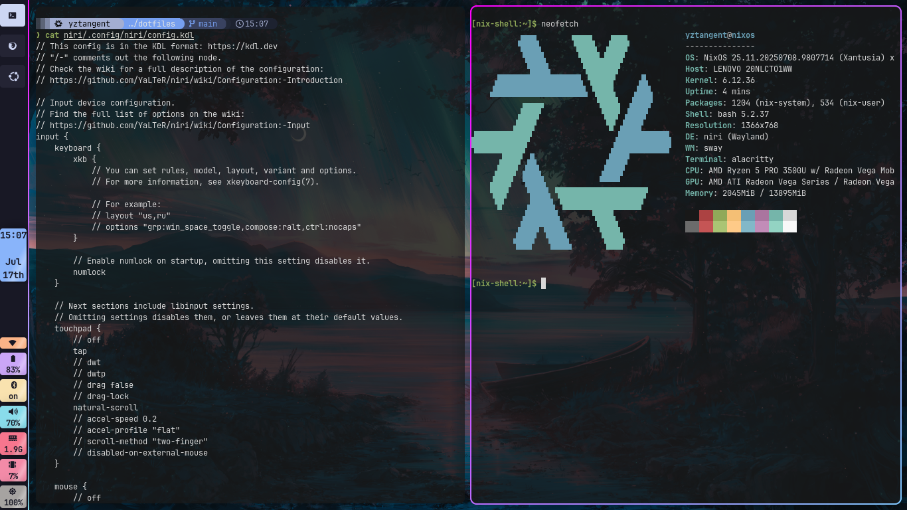

# NixOS Rice

## Setup
- OS: [NixOS](https://nixos.org/)
- Desktop manager: [Niri](https://github.com/YaLTeR/niri)
- Topbar: [Waybar](https://github.com/Alexays/Waybar)
- Shell: [fish](https://fishshell.com/)
- Terminal emulator: [Alacritty](https://alacritty.org/)
- Editor: [Neovim](https://neovim.io/)

## Workflow
This workflow is done using git and stow. The configuration files for each application are stored under their respective directories `~/dotfiles/<application>/`.
  - Example: all the config files for niri are stored under `~/dotfiles/niri`,such as `~/dotfiles/niri/.config/niri/config.kdl`.

1. Applying all configs: Use `stow *` to create symbolic links to every `~/dotfiles/<application>` subdirectory.
1. Applying the config for an application: Use `stow <application>` to create symbolic links pointing to the dotfiles in the `~/dotfiles/<application>` subdirectory.
    - Example: `stow zsh` creates a symlink from `~/.zshrc` to `~/dotfiles/zsh/.zshrc`.
1. Remove the config for an application: Use `stow -D <application>` to remove the symbolic links.

## Acknowledgements

Thank you to:
- [woioeow](https://github.com/woioeow/hyprland-dotfiles/tree/main) for their waybar dotfiles

