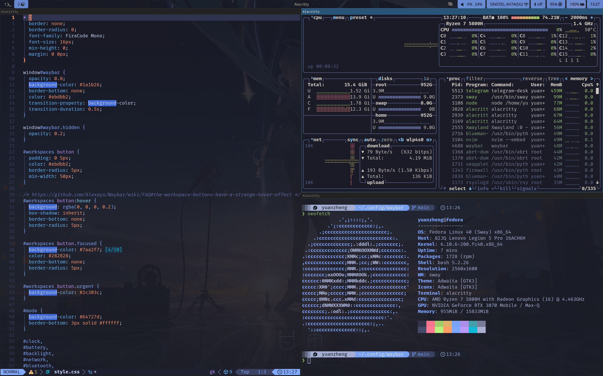

# Nobara Rice

## Setup

This setup is done using git and stow. The configuration files for each application are stored under their respective directories `~/dotfiles/<application>/`.
  - Example: all the config files for zsh are stored under `~/dotfiles/zsh`,such as `~/dotfiles/zsh/.zshrc`.

## Workflow:
1. Applying all configs: Use `stow *` to create symbolic links to every `~/dotfiles/<application>` subdirectory.
1. Applying the config for an application: Use `stow <application>` to create symbolic links pointing to the dotfiles in the `~/dotfiles/<application>` subdirectory.
  - Example: `stow zsh` creates a symlink from `~/.zshrc` to `~/dotfiles/zsh/.zshrc`.
1. Remove the config for an application: Use `stow -D <application>` to remove the symbolic links.

## Acknowledgements

Thank you to:
- [My linux for work](https://github.com/mylinuxforwork/dotfiles) for their waybar dotfiles
- [Alacritty themes](https://github.com/alacritty/alacritty-theme) for their alacritty theme templates
